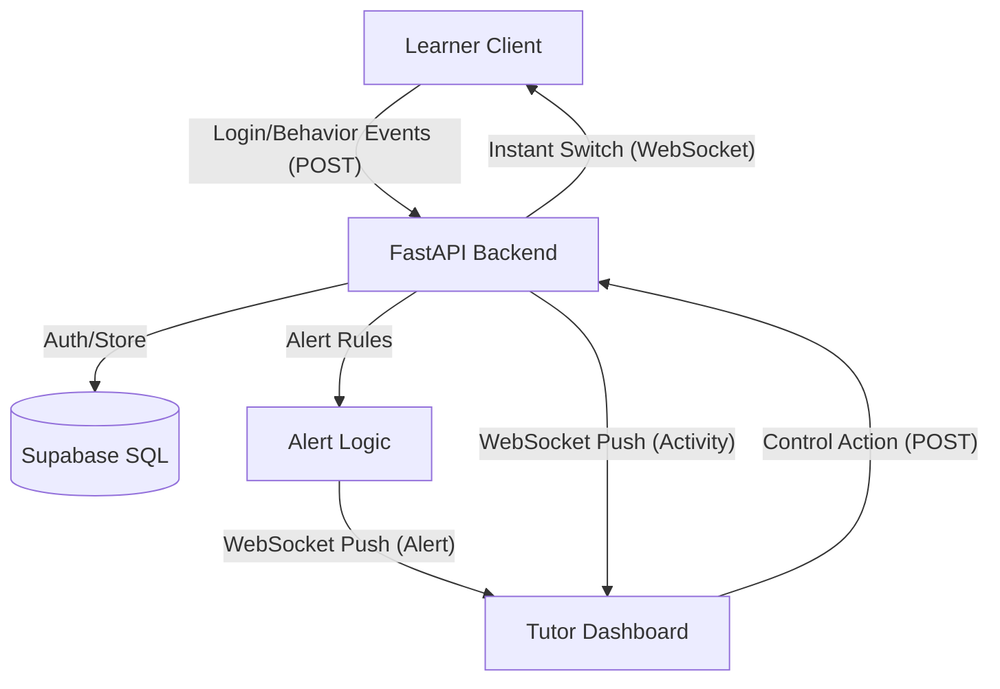

# Architecture & Data Flow

## System Design
The system follows a classic event-driven architecture with a real-time signaling layer and a persistent database for authentication and audit logs.

## Human-in-the-Loop (HITL)
Unlike traditional "Adaptive Learning" which often relies on automated algorithms, this prototype prioritizes **teacher agency**. 

- **Intelligence**: The backend identifies patterns (e.g., "Student is frustrated by this video").
- **Signal**: The teacher receives low-latency alerts and watches a live "System Log" console.
- **Decision**: The teacher uses pedagogical expertise to decide if a change of mode (e.g., Video to Text) is appropriate.
- **Action**: The "Universal Remote" button executes the switch instantly.

## Real-time Signaling
- **WebSockets**: Permanent duplex connections between the FastAPI server and all active clients.
- **Role Filtering**: Messages are granularly routed based on the user's role (Learner vs Tutor).
- **Unique IDs**: Clients use email-derived text IDs (e.g., `name_example_com`) for stable, human-readable session tracking.
