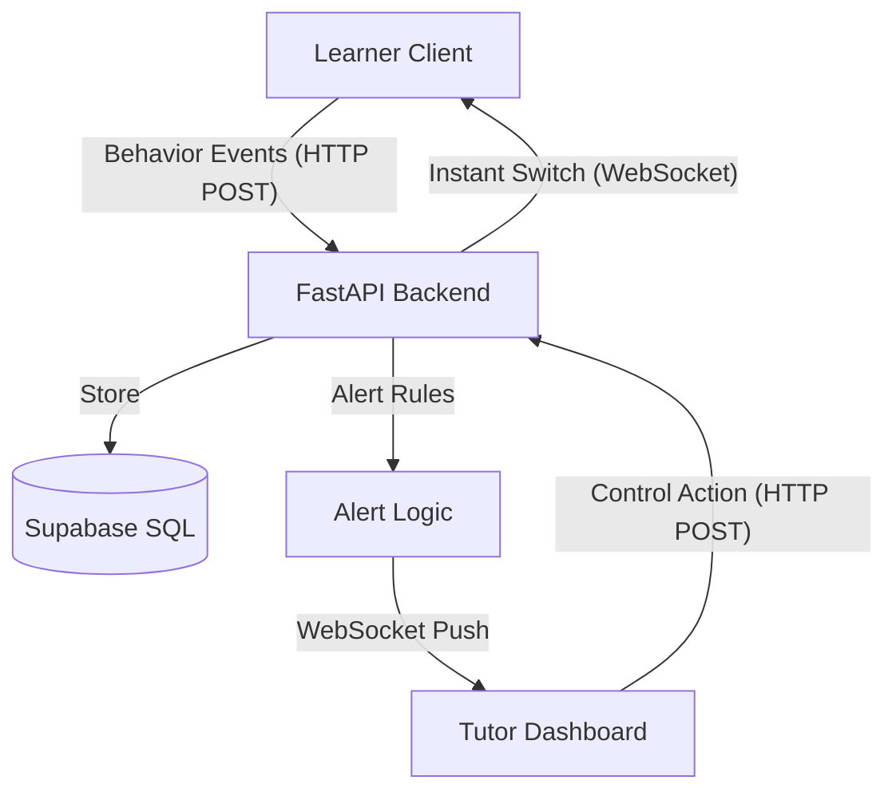

# Architecture & Data Flow

## System Design
The system follows a classic event-driven architecture with a real-time signaling layer.

## Human-in-the-Loop (HITL)
Unlike traditional "Adaptive Learning" which often relies on complex algorithms to decide what a student sees next, this prototype prioritizes **teacher agency**. 

- **Intelligence**: The backend identifies patterns (e.g., "Student is frustrated by this video").
- **Signal**: The teacher receives a low-latency alert.
- **Decision**: The teacher uses their pedagogical expertise to decide if a change of mode (e.g., Video to Text) is appropriate.
- **Action**: The "Universal Remote" button click executes the switch instantly.

## Real-time Signaling
- **WebSockets**: Used for server-to-client notifications. Every client (Learner/Tutor) maintains a persistent connection to the FastAPI server.
- **Unique IDs**: Clients identify themselves via email-derived IDs in the WebSocket URL path, allowing targeted messaging.
