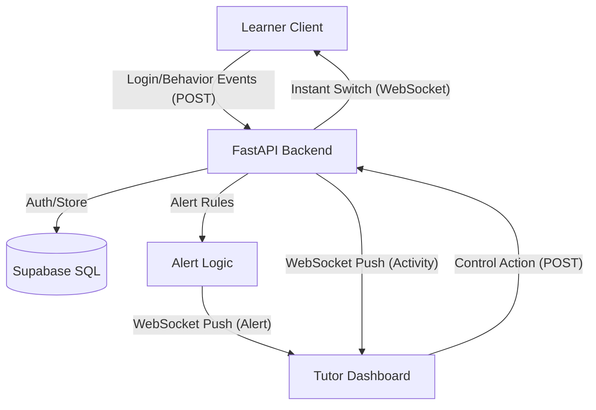

# Adaptive Learning Prototype: "Universal Remote Control"

This documentation provides an all-in-one guide to the **Adaptive Learning Prototype**, a system designed to empower educators with real-time "Universal Remote Control" over student learning mediums.

---

## 🚀 Vision & Core Concept
In a world of digital-first education, students often get distracted or stuck. This system provides:
1. **Real-time Insights**: Tutors see live alerts and a **Live System Log Terminal** when a student is disengaged (e.g., excessive pausing or long idle periods).
2. **Instant Intervention**: Tutors can switch the student's active content mode (Video, Text, Audio) with a single click—no page refreshes, no delays.
3. **Human-in-the-Loop (HITL)**: Instead of a purely automated black-box AI, this empowers the human educator with pedagogical expertise to make the final decision.

### 🎨 Premium Experience
- **Hero Landing**: Immersive role-selection portal.
- **Cinema Mode**: High-end video player with auto-hiding metadata overlays.
- **Audio Visualizers**: Dynamic pulse animations for audio-based learning.
- **Glassmorphism UI**: Modern, lightweight feel using `backdrop-filter` and neon accents.

---

## 🏗️ Architecture & Data Flow
The system follows an event-driven architecture with a real-time signaling layer.

### Real-time Signaling
- **WebSockets**: Permanent duplex connections between the FastAPI server and all active clients.
- **Role Filtering**: Messages are routed based on whether the user is a Learner or Tutor.
- **Unique IDs**: Clients use email-derived text IDs (e.g., `name_example_com`) for stable session tracking.

---

## 🎨 Frontend Implementation
Built with **React 18+**, **Vite**, and **Framer Motion**.

### UI Components
1. **Unified Landing Portal**: Handles role selection and authentication enforcement.
2. **Learner Dashboard**: 
   - **Cinema Mode**: Integrates **YouTube IFrame Player API** for event tracking.
   - **Audio Visualizer**: Pulsing animation synced with audio.
   - **Behavioral Sensors**: Monitors `scroll`, `idle` (30s), and `live` WebSocket status.
3. **Tutor Dashboard**: 
   - **Control Grid**: Cards for each student to trigger `MODE_SWITCH`.
   - **System Log Terminal**: Monospace console streaming raw JSON-like events.
   - **Critical Alerts**: Real-time warnings for "Excessive Pausing".

---

## ⚙️ Backend Implementation
Built with **FastAPI** and **Supabase-py**.

### Key API Endpoints
- `POST /login`: Authenticates users against Supabase.
- `POST /register_user`: Upserts user data (Role, Email, Password).
- `POST /events`: Receives behavioral signals (play, pause, scroll, idle). Broadcasts `ACTIVITY` to Tutors.
- `POST /control-action`: Sends targeted WebSocket `MODE_SWITCH` messages to Learners.

---

## 📊 Database Schema (Supabase/PostgreSQL)

### Identity Management
For robust demo tracking, `id` fields are **text-based** (e.g., `name_example_com`) to simplify debugging.

| Table | Description | Key Fields |
| :--- | :--- | :--- |
| `users` | Auth & Roles | `id`, `email`, `password`, `role` |
| `behavior_events` | Raw Stream | `user_id`, `event_type`, `metadata`, `created_at` |
| `alerts` | Triggered Warns | `user_id`, `alert_type`, `message` |
| `control_actions` | Tutor Audit | `tutor_id`, `learner_id`, `action_type`, `new_mode` |
| `session_logs` | Performance | `user_id`, `login_at`, `logout_at` |

---

## 🛠️ Setup & Running the Demo

### 1. Database Setup
1. Create a project at [Supabase](https://supabase.com).
2. Run the SQL located in `/database/schema.sql`.
3. Set `SUPABASE_URL` and `SUPABASE_KEY` in `backend/.env`.

### 2. Installation
- **Backend**: `pip install -r requirements.txt` -> `python main.py` (Port 8000)
- **Frontend**: `npm install` -> `npm run dev` (Port 5173)

### 3. Quick Start Demo
1. Open two browser windows.
2. Login as **Tutor**: `tutor@example.com` / `admin123`.
3. Login as **Learner**: `pramod@example.com` / `pass123`.
4. Play video/audio in Learner tab; watch the **System Log** in Tutor console.
5. Click **"Switch to Text"** in Tutor console; see the Learner view update instantly.
